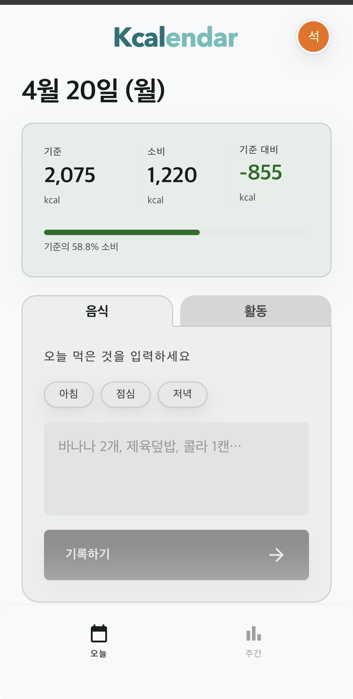
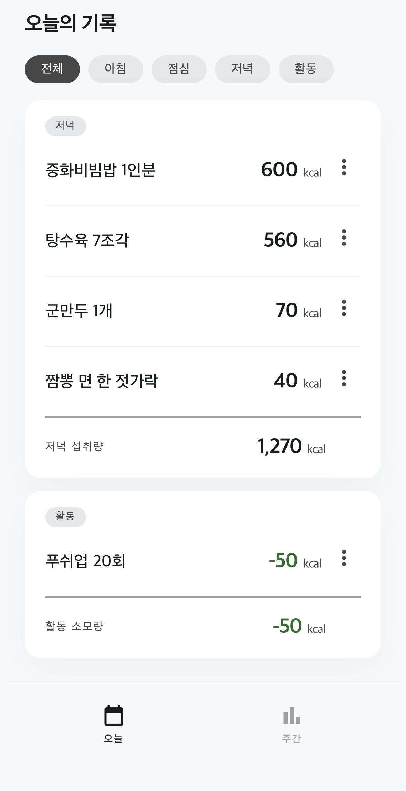
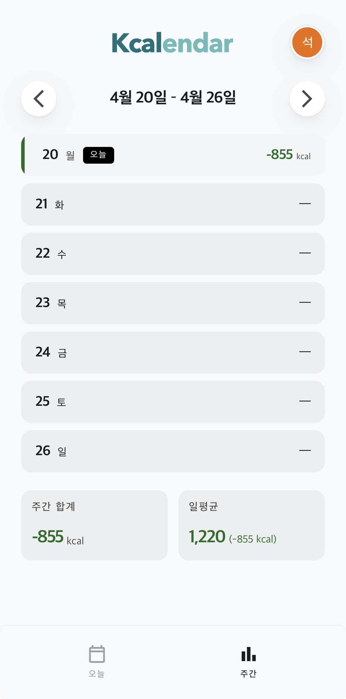

# kcalendar

> 자연어로 기록하는 칼로리 다이어리

기존 칼로리 앱은 음식을 검색하고 양을 정확히 입력해야 해서 번거롭습니다. kcalendar는 그냥 먹은 걸 말하듯 적으면 됩니다.

---

## 화면

<table>
  <tr>
    <td align="center"><b>오늘</b></td>
    <td align="center"><b>오늘의 기록</b></td>
    <td align="center"><b>주간</b></td>
  </tr>
  <tr>
    <td></td>
    <td></td>
    <td></td>
  </tr>
</table>

---

## 이런 분께 맞습니다

- 정확한 영양 분석보다 "오늘 대충 어떻게 먹었나"를 빠르게 확인하고 싶은 분

---

## 주요 기능

**자연어 입력**
"삼겹살 2인분이랑 소주 한 병", "점심에 편의점 도시락 하나"처럼 말하듯 적으면 AI가 칼로리를 계산해 줍니다. 오타나 구어체도 그대로 이해합니다.

**활동 기록**
"푸쉬업 20회", "걷기 40분"처럼 운동도 같은 방식으로 기록합니다. 소모 칼로리를 섭취량에서 자동으로 차감해 순 칼로리를 계산합니다.

**오늘 요약**
하루 기준 칼로리 대비 순 칼로리(식사 섭취 − 활동 소모)를 한눈에 확인합니다. 기준 칼로리는 키·몸무게·나이·성별 기반으로 자동 계산됩니다.

**주간 흐름**
이번 주 7일의 섭취량과 일평균을 한 화면에서 볼 수 있습니다. 날짜를 탭하면 그날의 상세 기록을 확인할 수 있습니다.

**기기 간 동기화**
Google 계정으로 로그인하면 여러 기기에서 같은 기록을 볼 수 있습니다. 로그인 없이 사용해도 기록은 이 기기에 저장됩니다.

---

## 사용해보기

[kcalendar-web.vercel.app](https://kcalendar-web.vercel.app)
